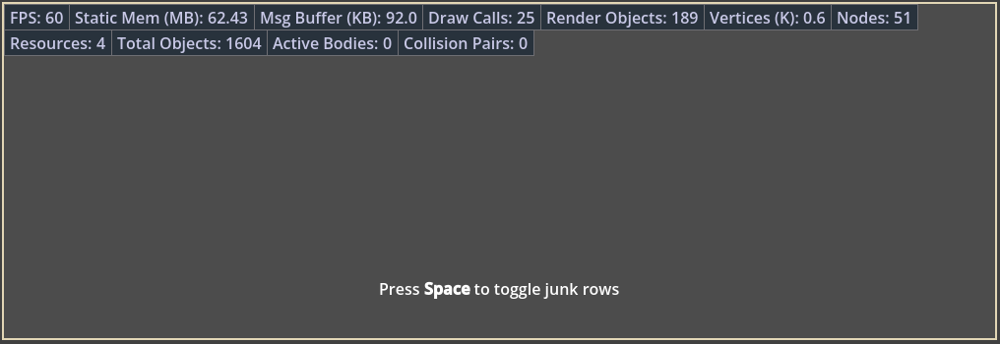

# Godot Debug Panel

It's a simple debug panel. You can download it [from Godot Asset Library](https://godotengine.org/asset-library/asset/5128). Enable `Dp` plugin to use it.

Here's how you can use it:

```gdscript
# Insert or update row by id with provided value
Dp.push(&"FPS", "%.0f" % Engine.get_frames_per_second())

# Hide row by id
Dp.hide(&"FPS")

# Show row by id
Dp.show(&"FPS")

# Erase row by id
Dp.erase(&"FPS")

# Remove all rows from panel
Dp.clear()

# Debug panel visibilty
Db.visible = false
Db.visible = true

```


